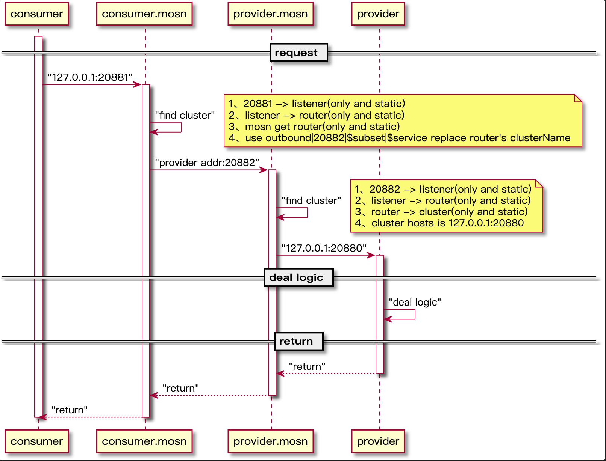

本教程提供中文版说明，请翻至本页底部。

In this course, you will learn how to use MOSN as the data plane of Istio for adapt dubbo env.

If you want to contribute or learn more about this tutorial, please join the [MOSN Istio WG](https://github.com/mosn/community/blob/master/wg-istio.md).

---

在本课程中，您将了解如何将 MOSN 作为 Istio Service Mesh 中的数据平面以用于适配 Dubbo 的场景。

如果那你想要进一步了解或贡献本教程，请加入 [MOSN Istio WG](https://github.com/mosn/community/blob/master/wg-istio.md)。

数据面流程图:

